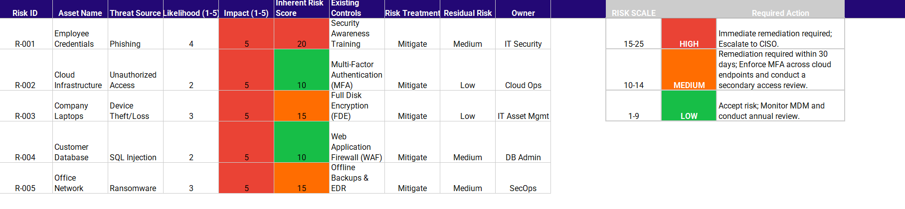

# Risk Assessment Project

## Objective
This project demonstrates foundational Governance, Risk, and Compliance (GRC) skills through the identification, analysis, and mitigation of cybersecurity risks.

## Skills Demonstrated
- Risk identification
- Risk analysis
- Risk scoring
- Security control recommendations
- Documentation and reporting

## Scenario
This assessment evaluates common cybersecurity risks affecting a small business environment.

## Framework References
- NIST Cybersecurity Framework (CSF)
- CIS Controls
- Basic Risk Management Principles

## Included Files
- Risk-Assessment-Table.md
- Risk-Register.md
- 

  ## Risk Scoring Methodology
To ensure objective analysis, this project utilizes a quantitative risk scoring matrix:
* **Likelihood (1-5):** Probability of the threat occurring.
* **Impact (1-5):** Potential damage to the organization.
* **Total Risk Score:** Likelihood × Impact.

### Scoring Legend
| Score | Risk Level | Action Required |
| :--- | :--- | :--- |
| **15 - 25** | **HIGH** | Immediate remediation; Escalate to C-Suite. |
| **10 - 14** | **MEDIUM** | Remediation required within 30-day sprint. |
| **1 - 9** | **LOW** | Accept risk; Review annually. |

---

## GRC Strategy & Workflow
To ensure a structured approach to risk management, I developed this lifecycle diagram. It illustrates the progression from identifying organizational assets to final compliance reporting, aligning with the NIST Cybersecurity Framework.

### Methodology Breakdown
* **Asset & Threat Identification:** Defining the scope of protection and potential adversaries.
* **Risk Assessment:** Calculating severity using the $Risk = Likelihood \times Impact$ formula.
* **Security Controls:** Implementing administrative and technical safeguards (e.g., MFA, encryption).
* **Reporting:** Documenting findings for stakeholders in the [Risk Register](Risk-Register.md).
