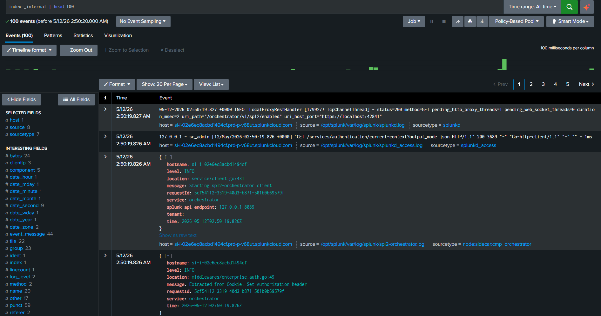

# Splunk Security Log Investigation Project

## Objective
This project demonstrates foundational Security Information and Event Management (SIEM) investigation skills using Splunk.

## Scenario
A review of authentication logs was conducted to identify suspicious failed login activity and potential unauthorized access attempts.

## Tools Used
- Splunk
- Security log analysis
- Basic SIEM investigation techniques

## Investigation Steps
1. Accessed Splunk Search & Reporting
2. Queried authentication failure events
3. Reviewed repeated failed login attempts
4. Identified suspicious activity patterns

## Findings
- Multiple failed login attempts detected
- Repeated authentication failures observed
- Potential brute force or unauthorized access behavior identified

## Recommendations
- Implement account lockout policies
- Enforce multi-factor authentication (MFA)
- Monitor authentication logs regularly
- Review suspicious IP activity

## Evidence

## Conclusion
The investigation successfully utilized Splunk to ingest and query system logs. By identifying 100 internal events, I demonstrated the ability to navigate a SIEM environment, apply time-range filters, and interpret sourcetype data—skills directly transferable to monitoring for unauthorized access and brute force attempts.
